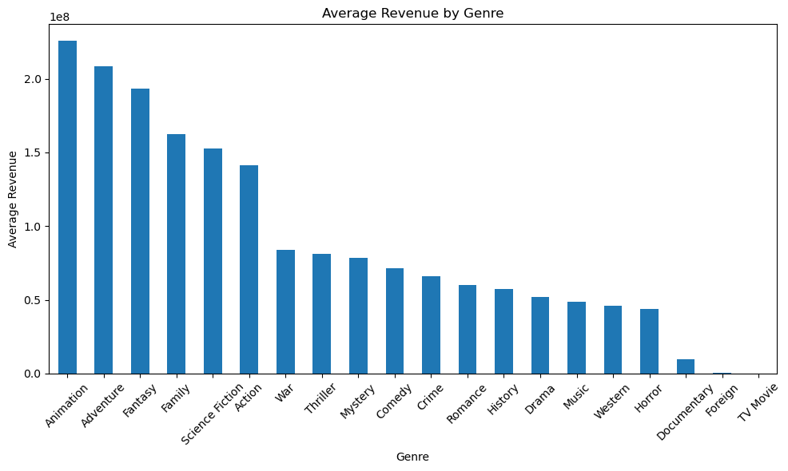
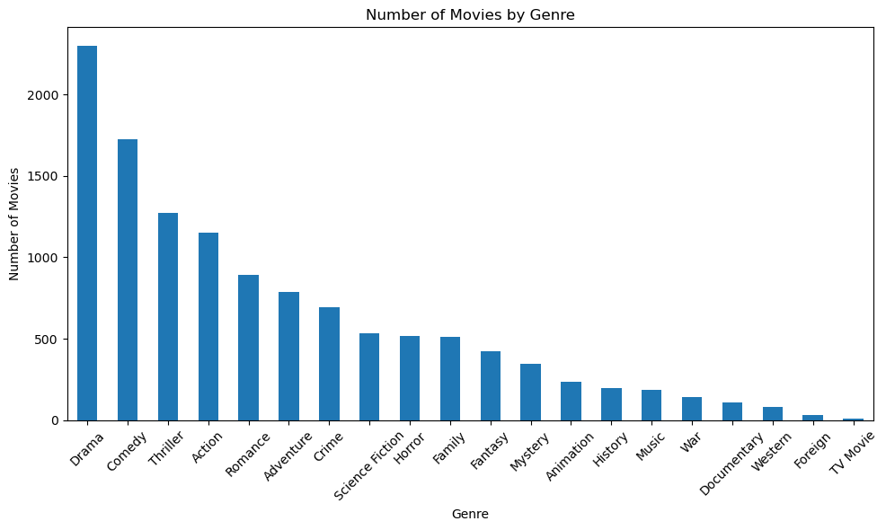
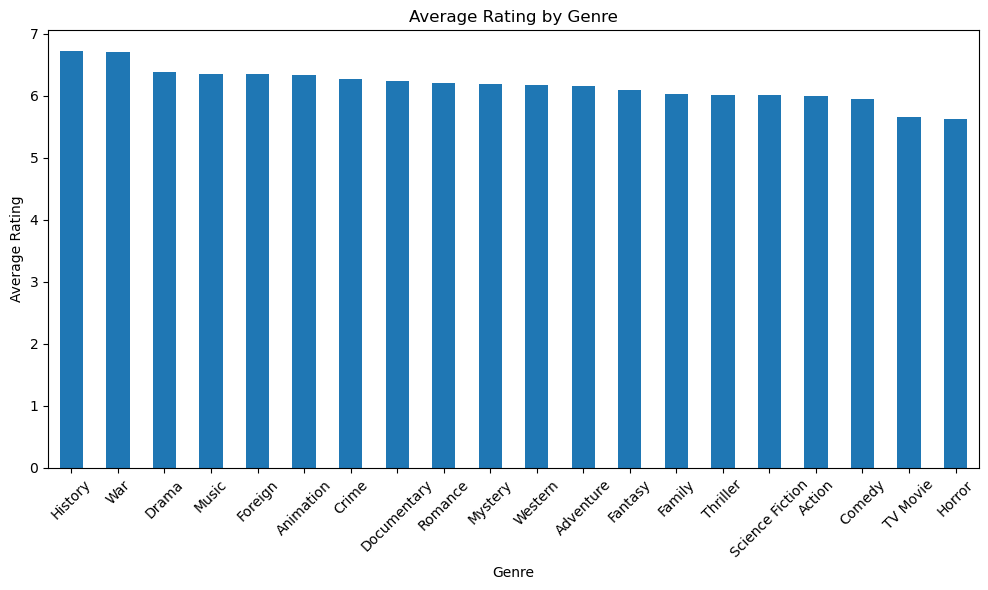

# TMDB Movie Analysis

## Project Overview

This project explores the TMDB 5000 Movie Dataset using Python and Pandas.

The analysis focuses on:

- Average Revenue by Genre
- Number of Movies by Genre
- Average Rating by Genre

---

## Dataset

- TMDB 5000 Movie Dataset
- 4,803 movies

---

## Tools

- Python
- Pandas
- Matplotlib
- Jupyter Notebook

---

## Data Preparation

Before analysis, the dataset was cleaned and transformed:

- Checked missing values and duplicate records.
- Converted `release_date` to datetime format.
- Parsed the nested `genres` column using `ast.literal_eval()`.
- Expanded movies with multiple genres into separate rows for genre-level analysis.

---

## Visualizations

### Average Revenue by Genre



Animation movies have the highest average revenue, followed by Adventure and Fantasy.

---

### Number of Movies by Genre



Drama is the most common genre, while TV Movie and Foreign have relatively few movies.

---

### Average Rating by Genre



Higher revenue does not necessarily correspond to higher audience ratings.

---

## Key Findings

- Animation has the highest average revenue among all genres.
- Drama is the most common movie genre in the dataset.
- High box office revenue does not necessarily correspond to higher audience ratings.
- Genres with small sample sizes (e.g., TV Movie and Foreign) should be interpreted with caution.

---

## Project Structure

```
movie-analysis/
│
├── data/
│   └── tmdb_5000_movies.csv
│
├── images/
│   ├── average_revenue_by_genre.png
│   ├── number_of_movies_by_genre.png
│   └── average_rating_by_genre.png
│
├── movie_analysis.ipynb
├── README.md
└── requirements.txt
```

---

## Future Improvements

- Analyze movie revenue trends over time.
- Explore the relationship between movie popularity and revenue.
- Build a machine learning model to predict movie revenue.
